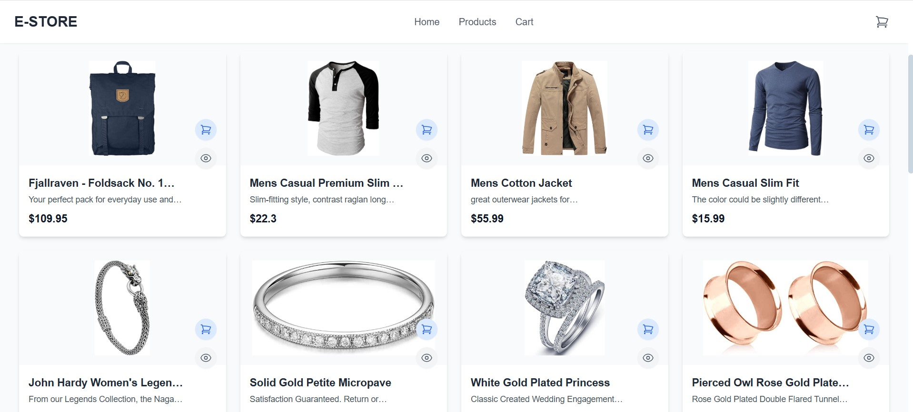
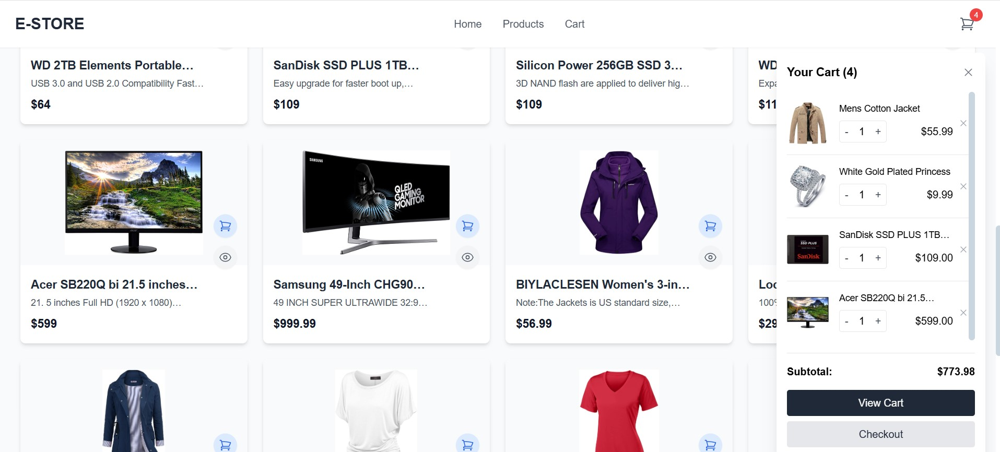

# E-STORE - Modern E-Commerce Platform

A fully responsive e-commerce web application built with React.js, Tailwind CSS, and Context API for state management.

## Table of Contents
- [Features](#features)
- [Demo](#demo)
- [Screenshots](#screenshots)
- [Technologies Used](#technologies-used)
- [Installation](#installation)
- [Folder Structure](#folder-structure)
- [Available Scripts](#available-scripts)
- [Deployment](#deployment)
- [Contributing](#contributing)
- [License](#license)

## Features

### Core Functionality
- **Product Catalog**: Browse products from FakeStoreAPI
- **Shopping Cart**: Add/remove items, adjust quantities
- **Responsive Design**: Works on all device sizes
- **Product Search & Filtering**: By category and search term

### User Experience
- Interactive product cards with quick actions
- Mini cart preview
- Smooth animations and transitions
- Persistent cart (localStorage)

### Technical Features
- React Context API for state management
- React Router for navigation
- Tailwind CSS for utility-first styling
- Responsive image handling
- Loading and error states

## Demo

[Live Demo](https://jayakumar-arizone-commerce.netlify.app/)

## Screenshots

| Home Page | Product Page | Cart |
|-----------|--------------|------|
|  |  |  |

## Technologies Used

### Frontend
- **React.js** (v18+)
- **React Router** (v6)
- **Tailwind CSS** (v3+)
- **Heroicons** (v2)
- **Axios** (for API calls)

### Development Tools
- VSCode
- ESLint
- Prettier
- Git

## Installation

Install dependencies :

npm install

Start the development server :

npm start

Open in browser :

[Open in browser](http://localhost:3000)